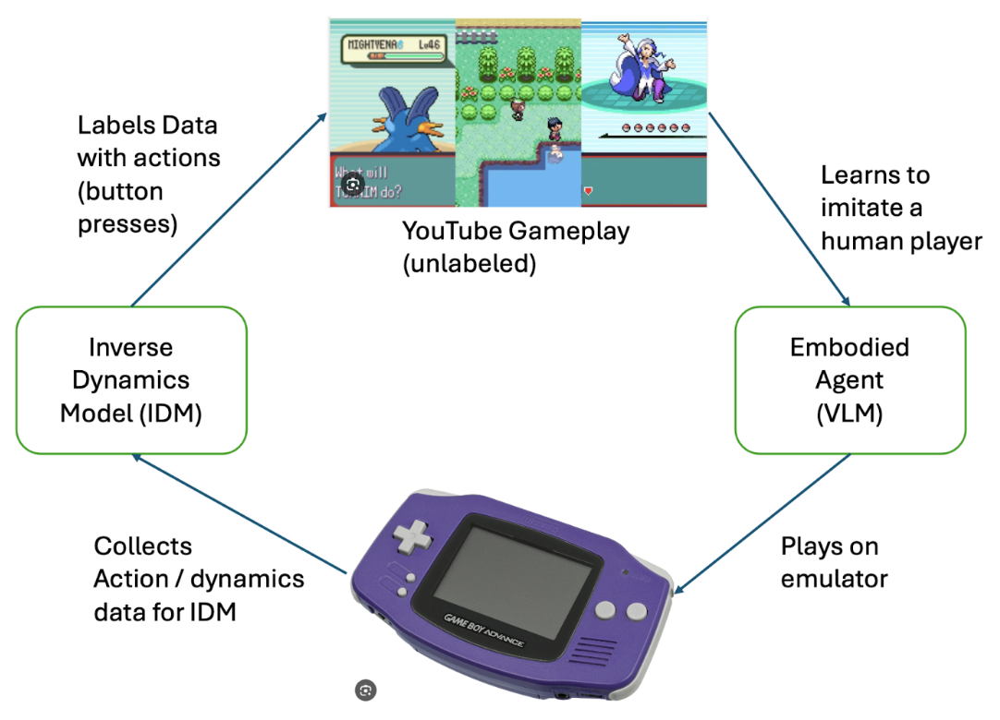

## ASH: Agents that Self-Hone from Starter to Pokémon Master via Embodied Lifelong Learning

  

## 💡 ASH in a Nutshell

Pokemon is a *long* game, with an aveage playthrough ranging from 30-100 hours of gameplay. This makes it very difficult to train a model that can "solve" pokemon upfront, especially as the visual and dynamics of the game evolve from the basics of starting the game to the more difficult tasks and areas in the late game. This makes it impossible to train a strong IDM (and by extension, an action agent) up front, as many dynamics are only revealed late game. To address this, ASH works by continually bootstrapping a both an IDM model and Embodied agent model. The key insight is that data artifacts obtained throughout agent gameplay are exetrmemly useful for refining the agent. In particular:

1. Data from the agent playing the game is useful for adapting the IDM to newer environment dynamics. 
2. Data from the agent playing the game is useful for retrieving relevant gameplay videos (scraped from the internet) which the agent can use to update its policy via behavioural cloning. 
3. A better IDM can be used to train a better Agent.

## 🔧 Project State

ASH is under heavy development currently, feel free to check out our code today or come back soon to try the completed agent!